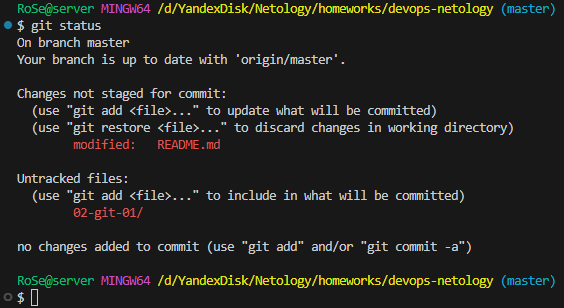
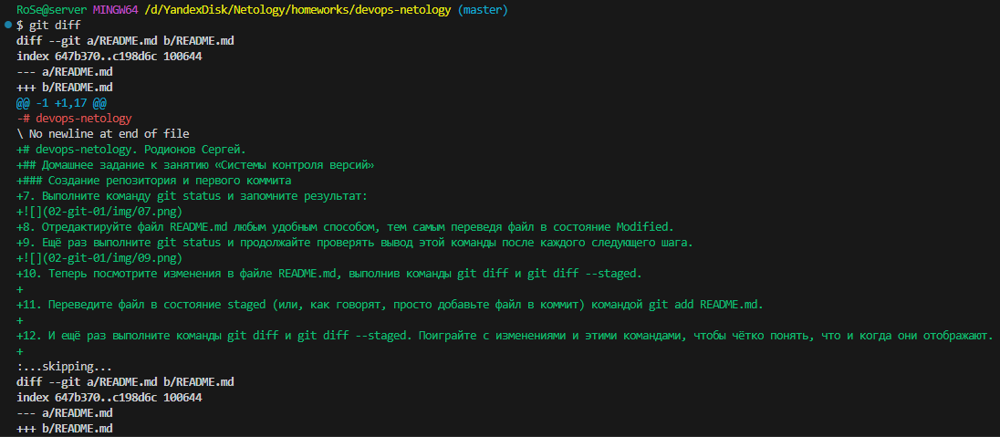
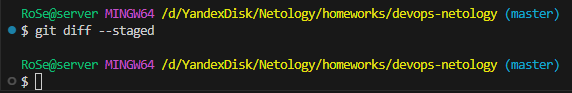
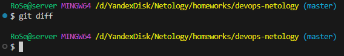
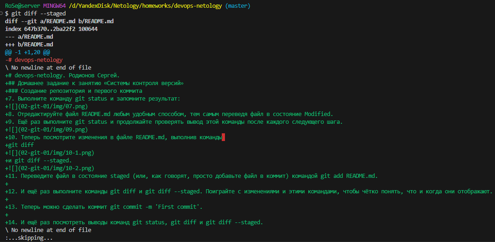
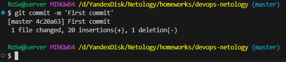
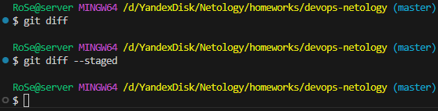
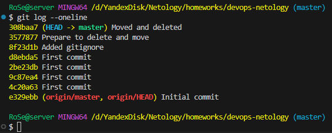

# devops-netology. Родионов Сергей.
## Домашнее задание к занятию «Системы контроля версий»
### Создание репозитория и первого коммита
7. Выполните команду git status и запомните результат:

8. Отредактируйте файл README.md любым удобным способом, тем самым переведя файл в состояние Modified.
9. Ещё раз выполните git status и продолжайте проверять вывод этой команды после каждого следующего шага.

10. Теперь посмотрите изменения в файле README.md, выполнив команды 
git diff

и git diff --staged.

11. Переведите файл в состояние staged (или, как говорят, просто добавьте файл в коммит) командой git add README.md.
12. И ещё раз выполните команды git diff и git diff --staged. Поиграйте с изменениями и этими командами, чтобы чётко понять, что и когда они отображают.

13. Теперь можно сделать коммит git commit -m 'First commit'.

14. И ещё раз посмотреть выводы команд git status, git diff и git diff --staged.

### Создание файлов .gitignore и второго коммита
Благодаря добавленному .gitignore файлу, следующие файлы и директории будут проигнорированы Git в будущем:
- Локальные директории Terraform:
- Файлы состояния Terraform:
- Файлы логов аварийных завершений:
- Файлы переменных Terraform (содержащие потенциально чувствительные данные):
- Файлы переопределения ресурсов (override files):
- Файлы блокировки состояния Terraform:
- Файлы конфигурации CLI Terraform:

### Эксперимент с удалением и перемещением файлов (третий и четвёртый коммит)

### Проверка изменения

