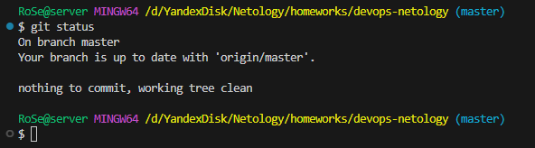

# devops-netology. Родионов Сергей.
## Домашнее задание к занятию «Системы контроля версий»
### Создание репозитория и первого коммита
7. Выполните команду git status и запомните результат:

8. Отредактируйте файл README.md любым удобным способом, тем самым переведя файл в состояние Modified.
9. Ещё раз выполните git status и продолжайте проверять вывод этой команды после каждого следующего шага.

10. Теперь посмотрите изменения в файле README.md, выполнив команды 
git diff

и git diff --staged.

11. Переведите файл в состояние staged (или, как говорят, просто добавьте файл в коммит) командой git add README.md.
12. И ещё раз выполните команды git diff и git diff --staged. Поиграйте с изменениями и этими командами, чтобы чётко понять, что и когда они отображают.


13. Теперь можно сделать коммит git commit -m 'First commit'.

14. И ещё раз посмотреть выводы команд git status, git diff и git diff --staged.


### Создание файлов .gitignore и второго коммита
Вот основные правила и примеры работы синтаксиса gitignor:
1. Базовые правила 
    1. Игнорирование конкретных файлов
        ```gitignore
        filename.txt
        ```
        Будет проигнорирован файл filename.txt в корне проекта.

    2. Игнорирование всех файлов с определённым расширением
        ```gitignore
        *.log
        ```
        Игнорируются все файлы, заканчивающиеся на .log (например, debug.log, error.log).

    3. Игнорирование файлов в любом месте проекта
        ```gitignore
        **/temp/
        ```
        Игнорирует все директории с именем temp (например, /temp, src/temp, docs/images/temp).

2. Специальные символы
    1. / — Указывает на корень проекта
        ```gitignore
        /build/
        ```
        Игнорирует только папку /build в корне, но не src/build или другие вложенные.
    2. * — Любое количество символов (кроме /)
        ```gitignore
        *.tmp
        ```
        Игнорирует все файлы, заканчивающиеся на .tmp (например, temp.tmp, backup.tmp).
    3. ? — Один любой символ
        ```gitignore
        file?.txt
        ```
        Игнорирует file1.txt, fileA.txt, но не file10.txt.
    4. [] — Диапазон символов
        ```gitignore
        file[0-9].txt
        ```
        Игнорирует file0.txt, file1.txt, ..., file9.txt, но не fileA.txt.
    5. ! — Исключение (отмена игнорирования)
        ```gitignore
        *.txt
        !important.txt
        ```
        Игнорирует все .txt файлы, кроме important.txt.

3. Благодаря добавленному .gitignore файлу, следующие файлы и директории будут проигнорированы Git в будущем:
    - Локальные директории Terraform:
        ```gitignore
        .terraform/
        ```
    - Файлы состояния Terraform:
        ```gitignore
        *.tfstate
        *.tfstate.*
        ```
    - Файлы логов аварийных завершений:
        ```gitignore
        crash.log
        crash.*.log
        ```
    - Файлы переменных Terraform (содержащие потенциально чувствительные данные):
        ```gitignore
        *.tfvars
        *.tfvars.json
        ```
    - Файлы переопределения ресурсов (override files):
        ```gitignore
        override.tf
        override.tf.json
        *_override.tf 
        *_override.tf.json
        ```
    - Файлы блокировки состояния Terraform:
        ```gitignore
        .terraform.tfstate.lock.info
        ```
    - Файлы конфигурации CLI Terraform:
        ```gitignore
        .terraformrc
        terraform.rc
        ```

### Эксперимент с удалением и перемещением файлов (третий и четвёртый коммит)

### Проверка изменения

