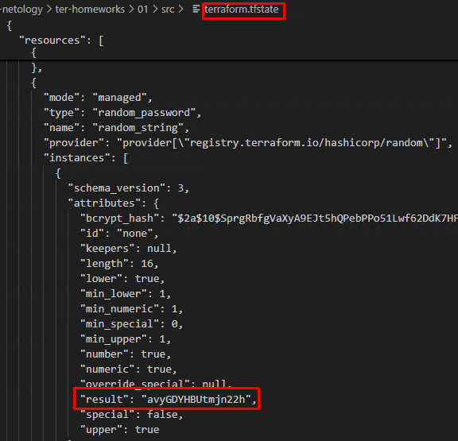
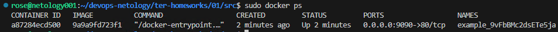
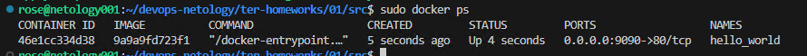
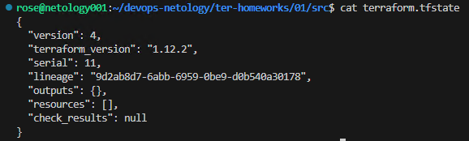

# Домашнее задание к занятию «Введение в Terraform» - Родионов Сергей

## Задание 1

1. Перейдите в каталог [**src**](https://github.com/netology-code/ter-homeworks/tree/main/01/src). Скачайте все необходимые зависимости, использованные в проекте.

        Terraform загрузит провайдер docker и другие зависимости, указанные в конфигурации.

2. Изучите файл **.gitignore**. В каком terraform-файле, согласно этому .gitignore, допустимо сохранить личную, секретную информацию?(логины,пароли,ключи,токены итд)

        Ответ: Секретную информацию можно хранить в terraform.tfvars или *.auto.tfvars, так как они добавлены в .gitignore.

        В нашем случае хранить чувствительную информацию надо в файле personal.auto.tfvars

3. Выполните код проекта. Найдите  в state-файле секретное содержимое созданного ресурса **random_password**, пришлите в качестве ответа конкретный ключ и его значение.
        
        Запускаем terraform apply для создания ресурсов.
        Ищем секретное значение в terraform.tfstate.
        Ответ: Ключ result содержит сгенерированный пароль.
    
        
4. Раскомментируйте блок кода, примерно расположенный на строчках 29–42 файла **main.tf**.
Выполните команду ```terraform validate```. Объясните, в чём заключаются намеренно допущенные ошибки. Исправьте их.

        Ошибки:
        Неправильное имя ресурса ("docker_image" вместо "docker_image" "nginx").
        Неправильное имя ресурса ("1nginx").
        Некорректныей вызов генерации имени контейнера.

5. Выполните код. В качестве ответа приложите: исправленный фрагмент кода и вывод команды ```docker ps```.

    ```
    resource "docker_image" "nginx" {
    name         = "nginx:latest"
    keep_locally = true
    }

    resource "docker_container" "nginx" {
    image = docker_image.nginx.image_id
    name  = "example_${random_password.random_string.result}"

    ports {
        internal = 80
        external = 9090
    }
    }
    ```

    

6. Замените имя docker-контейнера в блоке кода на ```hello_world```. Не перепутайте имя контейнера и имя образа. Мы всё ещё продолжаем использовать name = "nginx:latest". Выполните команду ```terraform apply -auto-approve```.
Объясните своими словами, в чём может быть опасность применения ключа  ```-auto-approve```. Догадайтесь или нагуглите зачем может пригодиться данный ключ? В качестве ответа дополнительно приложите вывод команды ```docker ps```.

        Опасность -auto-approve:
        Ключ автоматически подтверждает действия без проверки пользователем, что может привести к неожиданному изменению или удалению ресурсов.
        Применение: Полезен в CI/CD-пайплайнах для автоматизации.
    
    

7. Уничтожьте созданные ресурсы с помощью **terraform**. Убедитесь, что все ресурсы удалены. Приложите содержимое файла **terraform.tfstate**. 

    
    
8. Объясните, почему при этом не был удалён docker-образ **nginx:latest**. Ответ **ОБЯЗАТЕЛЬНО НАЙДИТЕ В ПРЕДОСТАВЛЕННОМ КОДЕ**, а затем **ОБЯЗАТЕЛЬНО ПОДКРЕПИТЕ** строчкой из документации [**terraform провайдера docker**](https://docs.comcloud.xyz/providers/kreuzwerker/docker/latest/docs).  (ищите в классификаторе resource docker_image )

        Ответ по коду:
        В коде ресурса docker_image установлен параметр keep_locally = true, поэтому образ не удаляется.

        Подтверждение из документации:
        
        keep_locally (Boolean) If true, then the Docker image won't be deleted on destroy operation. If this is false, it will delete the image from the docker local storage on destroy operation.